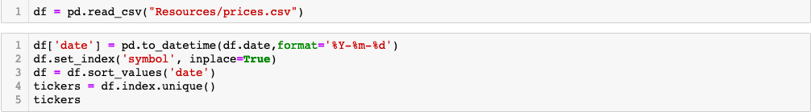
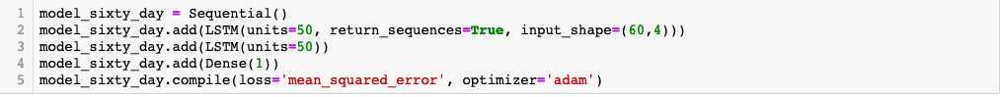
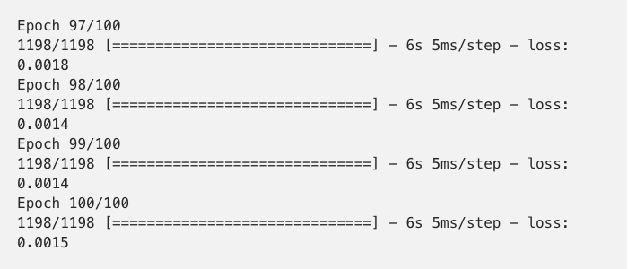
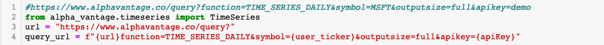
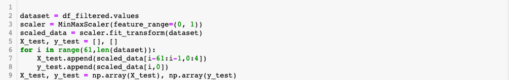
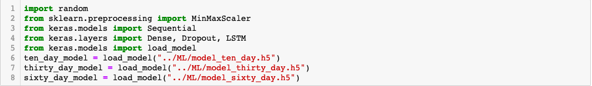

# Using an LSTM Model To Predict Closing Stock Prices

## Goals:

-  Predict as accurately as possible the closing stock price for a given stock.
-  Fit three models on three different time intervals. Ten days, thirty days, and sixty days. 
-  Show model performance over test data so as to provide user with the basis of trust in the model.
-  Open the door for further development of a minute to minute stock prediction platform. 

      

# Step 1: Choosing a Model

## Why an LSTM Model and what is it?

- An LSTM Model is a recurrent neural network (RNN) and over time, RNNS have proved themselves as one of the most powerful models for processing sequential data. In our case this is time series data.
- LSTM introduces the concept of a  "memory cell", a unit of computation that replaces traditional artificial neurons in the hidden layer of the network. 
- With these memory cells, networks are able to effectively associate "memories" and input remote in time, therefore prove to be well suited to grasp structure of data dynamically over time with high prediction capacity.
- Obviously, this type of model sacrifices much interoperability and because of this a level of artistry in tuning is required. 
- It would therefore be impotant for the user in this particular instance to possibly develop an algorithmic trading strategy on top that takes in to account the models performance over time and whether it's predictions should be trusted based on other factors.   

# Step 2: Training Data

- Five years of stock data was collected spanning years 2010-2016.
- Metrics used to train models were open, low, high, close and volume.

 

# Step 3: Pre-processing Traning Data

- Test data was scaled and preproccessed for each of the models (10 day, 30 day, 60 day) 

# Step 4: Construction of Model and Layers 

- Layers are added for each respective model

# Step 4: Training Models

# Step 5: ETL and API Call for Real Data

- In order to pull real recent data for models to perform on real data an ETL pipeline with an API call was constructed.
- Quandl is no longer updated and Yahoo finance and Google Finance have been deprecated.
- We settled on Alpha Vantage to pull the real data for the last year for the models to perform on. 

## Data is pre-processed 

## Models are loaded

## Predictions are calculated 

# Future Possibilities 

- More layers of machine learning used to develop trading strategies which utilize the model's predictions and react to the model's accuracy over time.
- Reinforcement learning to improve model's performance by learning from it's real time predictions.
- Create minute to minute predictions using models to open the door for high volume trading potential.
